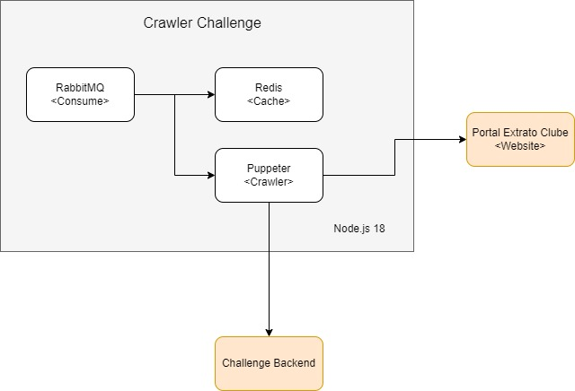

# Challenge Crawler

## Objetivo

- Executar um worker que faz o consumo de uma fila RabbitMQ que recebe os registros de cpf's que serão consultados
- A aplicação verifica se o cpf a ser consultado está presente no cache do redis
- Caso o cpf não esteja em cache, será executado o crawler.
    - O Crawler irá obter os dados dos beneficios
    - Salvar o resultado em cache
    - Retornar o fluxo de requisição para o backend salvar os dados no elastic search

## Arquitetura

## Backend

O backend da solução está descrito no repositório abaixo

https://github.com/huguinho-halves/challenge-crawler-backend

## Gravação com o crawler funcionando

Fiz uma gravação com o motor funcionando, está disponível através do link abaixo.

https://www.loom.com/share/fd1963dc1b434731b520c8dd69579089

Como até o momento nenhum dos cpf's forncedidos retornava benefício, eu mantive o robo na tela de resultados